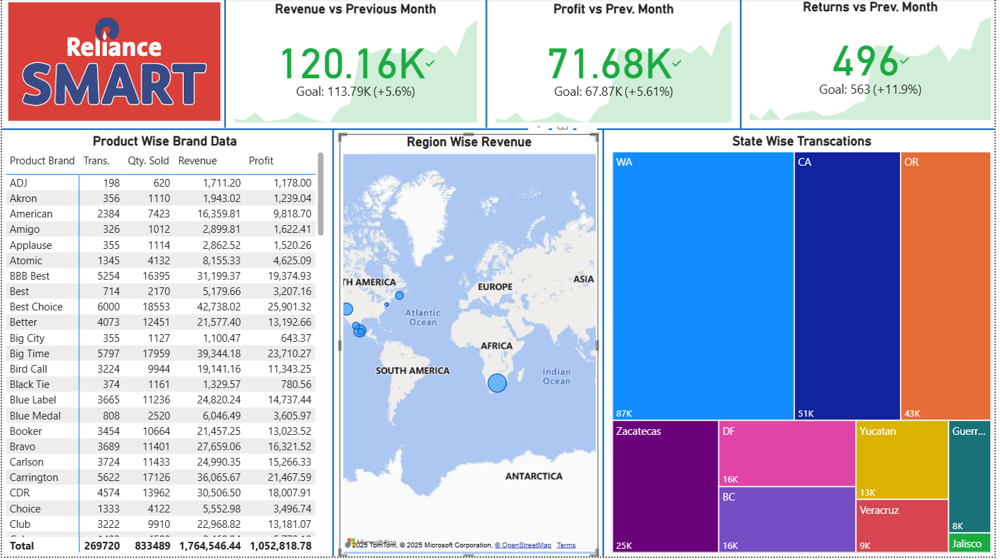

# 🛍 Reliance Smart - Retail Sales Dashboard (Power BI)

## 📌 Overview

This project contains a **Retail Sales Dashboard** created in **Power BI** for **Reliance Smart**.
It provides detailed insights into **product-wise sales, regional performance, state-wise transactions, and monthly trends**.
The dashboard helps retail managers monitor growth, profitability, and customer returns efficiently.

---

## 🚀 Features

* **KPIs**

  * Revenue vs Previous Month: **120.16K** (+5.6%)
  * Profit vs Previous Month: **71.68K** (+5.61%)
  * Returns vs Previous Month: **496** (+11.9%)

* **Product-Wise Analysis**

  * Transactions, Quantity Sold, Revenue, and Profit for each brand
  * Granular comparison with totals

* **Visuals**

  * Region-Wise Revenue (world map)
  * State-Wise Transactions (treemap)
  * Product-Wise Brand Data (detailed table)

---

## 📂 Files

* `New Reliance Sales Report.pbix` → Power BI dashboard file
* `Screenshot 2025-09-04 012708.png` → Dashboard preview

---

## 🛠 Tools & Skills Used

* **Power BI Desktop**

  * Power Query for Data Cleaning
  * DAX (Data Analysis Expressions)
  * Geo Maps for Regional Revenue
  * Tree Map & KPI Cards
  * Interactive Data Exploration

---

## 📸 Dashboard Preview

---

## 🔧 How to Use

1. Download the `.pbix` file.
2. Open it in **Power BI Desktop**.
3. Use filters & slicers to explore transactions, regions, and brands.
4. Analyze monthly growth, profitability, and state-wise performance.

---

## 💡 Insights You Can Gain

* Track **monthly revenue, profit, and returns growth**.
* Identify **top-performing product brands**.
* Analyze **regional contribution to sales**.
* Drill down into **state-level transactions**.
* Compare **actual performance vs goals**.

---

## 📌 Future Enhancements

* Add **customer segmentation (loyalty vs new buyers)**.
* Integrate **real-time POS data** from Reliance stores.
* Advanced forecasting using **Power BI AI Insights**.

---

## 👨‍💻 Author

**Raunak Patel**
📌 Computer Science Engineering Student
📊 Skilled in Excel, Power BI, and Data Analytics

---
